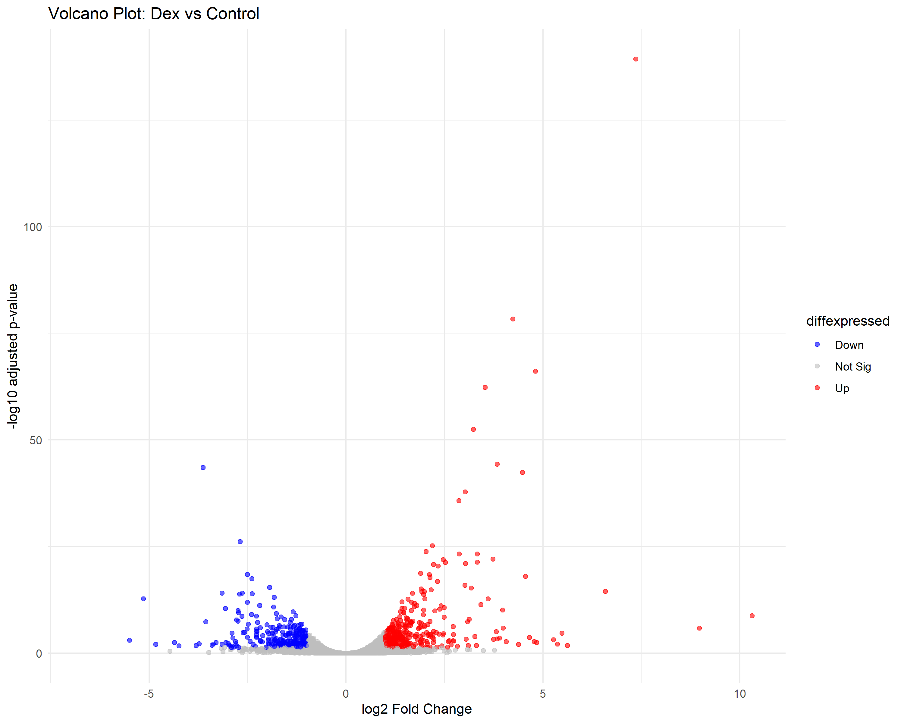

# RNA-seq Differential Expression Analysis: Dexamethasone Treatment in Airway Smooth Muscle Cells

## Overview
This project performs an end-to-end RNA-seq analysis on publicly available human airway smooth muscle cell data to identify genes differentially expressed following dexamethasone (a corticosteroid) treatment. The analysis was independently reproduced through two pipelines — a GUI-based workflow in Galaxy, and a command-line workflow (this repository) — to validate reproducibility.

## Dataset
- **Source**: [GEO GSE52778](https://www.ncbi.nlm.nih.gov/geo/query/acc.cgi?acc=GSE52778)
- **Samples used**: 4 paired-end samples (2 untreated controls, 2 dexamethasone-treated), from 2 cell lines
  - SRR1039508 (Control), SRR1039509 (Dexamethasone)
  - SRR1039512 (Control), SRR1039513 (Dexamethasone)

## Pipeline
1. **Quality control**: FastQC, MultiQC
2. **Trimming**: fastp
3. **Alignment**: HISAT2 (GRCh38 genome), ~97%+ alignment rate across all samples
4. **Quantification**: featureCounts (Ensembl GTF annotation)
5. **Differential expression**: DESeq2 (R/Bioconductor)
6. **Visualization**: Volcano plot (ggplot2)

Scripts for each step are in [`scripts/`](scripts/), numbered in pipeline order.

## Key Results
- **943 significantly differentially expressed genes** (padj < 0.05): 538 upregulated, 405 downregulated
- Top hits included **FKBP5** and **TSC22D3 (GILZ)** — well-established glucocorticoid-response genes — validating that the analysis correctly captured dexamethasone's known biological mechanism
- **VCAM1** (an inflammation-associated adhesion molecule) was significantly downregulated, consistent with dexamethasone's anti-inflammatory action

Full results: [`results/DESeq2_results_annotated.csv`](results/DESeq2_results_annotated.csv)
Top 25 genes: [`results/top_significant_genes.csv`](results/top_significant_genes.csv)

## Tools Used
FastQC, MultiQC, fastp, HISAT2, Subread (featureCounts), R/DESeq2, ggplot2 — managed via conda environment on WSL (Ubuntu).

## Notes
This project was completed as an independent learning exercise in RNA-seq analysis, building on interests in transcriptomic regulation from prior MSc research on non-coding RNA in cancer biology.
